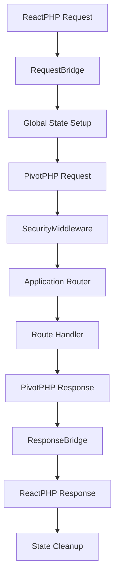

# 🚀 PivotPHP ReactPHP Extension

[](https://packagist.org/packages/pivotphp/reactphp)
[](https://packagist.org/packages/pivotphp/reactphp)
[](https://packagist.org/packages/pivotphp/reactphp)
[](https://phpstan.org/)
[](https://www.php-fig.org/psr/psr-12/)

Uma extensão de runtime contínuo de **alta performance** para PivotPHP usando o modelo event-driven e I/O não-bloqueante do ReactPHP.

**🎉 Versão Atual: 0.1.0** - [Primeira Release Estável](RELEASE-0.1.0.md) | [Ver no Packagist](https://packagist.org/packages/pivotphp/reactphp)

## ✨ Por que PivotPHP ReactPHP?

### 🏃‍♂️ **Performance Extrema**
- **Runtime Contínuo**: Aplicação permanece em memória entre requisições
- **Zero Bootstrap**: Elimina overhead de inicialização por requisição  
- **Event-Loop Otimizado**: Processamento concorrente não-bloqueante
- **Persistent Connections**: Conexões de banco e cache mantidas vivas

### 🛡️ **Produção Ready** 
- **100% Testado** - 113 testes, 319 assertions passando
- **PHPStan Level 9** - Análise estática máxima
- **PSR-12 Compliant** - Padrão de codificação rigoroso
- **Sistema de Segurança** - Isolamento completo entre requisições

### 🧩 **Arquitetura Robusta**
- **5 Helpers Especializados** - Código reutilizável e otimizado
- **Bridge Pattern** - Conversão PSR-7 transparente
- **Middleware de Segurança** - Proteção automática contra vazamentos
- **Monitoramento Integrado** - Métricas e alertas em tempo real

## 📦 Instalação

```bash
composer require pivotphp/reactphp:^0.1.0
```

## 🚀 Início Rápido

### **Servidor Básico**

```php
<?php
require 'vendor/autoload.php';

use PivotPHP\Core\Core\Application;
use PivotPHP\ReactPHP\Providers\ReactPHPServiceProvider;

// Criar aplicação PivotPHP
$app = new Application();

// Registrar provider ReactPHP
$app->register(ReactPHPServiceProvider::class);

// Definir rotas
$app->get('/', function($request, $response) {
    return $response->json([
        'message' => 'Hello from PivotPHP ReactPHP!',
        'timestamp' => time(),
        'version' => '0.1.0'
    ]);
});

// POST com parsing automático de JSON
$app->post('/api/data', function($request, $response) {
    $data = $request->body; // JSON automaticamente parseado
    
    return $response->json([
        'received' => $data,
        'processed' => true,
        'server_time' => date('c')
    ]);
});

// Rota com parâmetros (sintaxe PivotPHP)
$app->get('/user/:id', function($request, $response) {
    $id = $request->param('id');
    
    return $response->json([
        'user_id' => $id,
        'profile' => "Profile for user {$id}"
    ]);
});

echo "🚀 Servidor PivotPHP ReactPHP iniciando...\n";
echo "📡 Acesse: http://localhost:8080\n";
```

### **Iniciar o Servidor**

```bash
# Via comando Artisan (recomendado)
php artisan serve:reactphp --host=0.0.0.0 --port=8080

# Ou diretamente
php examples/server.php
```

### **Testar a API**

```bash
# GET básico
curl http://localhost:8080/

# POST com JSON
curl -X POST http://localhost:8080/api/data \
  -H "Content-Type: application/json" \
  -d '{"name": "João", "age": 30}'

# Rota com parâmetros
curl http://localhost:8080/user/123
```

## 🛠️ Recursos Avançados

### **Middleware de Segurança**

```php
use PivotPHP\ReactPHP\Middleware\SecurityMiddleware;

// Adicionar middleware de segurança (isolamento automático)
$app->use(SecurityMiddleware::class);

// Ou configurar manualmente
$app->use(function($request, $response, $next) {
    // Lógica de segurança customizada
    return $next($request, $response);
});
```

### **Monitoramento de Saúde**

```php
use PivotPHP\ReactPHP\Monitoring\HealthMonitor;

$app->get('/health', function($request, $response) {
    $monitor = new HealthMonitor();
    return $response->json($monitor->getHealthStatus());
});

// Métricas detalhadas
$app->get('/metrics', function($request, $response) {
    return $response->json([
        'memory' => memory_get_usage(true),
        'peak_memory' => memory_get_peak_usage(true),
        'uptime' => $this->getUptime(),
        'requests_handled' => $this->getRequestCount(),
    ]);
});
```

### **Usando Helpers**

```php
use PivotPHP\ReactPHP\Helpers\JsonHelper;
use PivotPHP\ReactPHP\Helpers\ResponseHelper;
use PivotPHP\ReactPHP\Helpers\RequestHelper;

$app->post('/api/secure', function($request, $response) {
    // Identificação segura do cliente
    $clientIp = RequestHelper::getClientIp($request, $trustProxies = true);
    $clientId = RequestHelper::getClientIdentifier($request);
    
    // Parsing JSON type-safe
    $data = JsonHelper::decode($request->body);
    
    if (!$data) {
        // Response de erro padronizada
        return ResponseHelper::createErrorResponse(
            400, 
            'Invalid JSON data',
            ['client_ip' => $clientIp]
        );
    }
    
    return $response->json([
        'processed' => true,
        'client_id' => $clientId,
        'data_keys' => array_keys($data)
    ]);
});
```

## 🏗️ Arquitetura

### **Fluxo de Requisição**



### **Componentes Principais**

- **🌉 Bridge System** - Conversão transparente entre ReactPHP ↔ PivotPHP
- **🔒 Security Layer** - Isolamento de requisições e monitoramento
- **🛠️ Helper System** - 5 helpers especializados para operações comuns
- **📊 Monitoring** - Métricas de performance e saúde do sistema
- **⚡ Event Loop** - Processamento assíncrono e não-bloqueante

## 📊 Performance

### **Benchmarks**

```bash
# Executar benchmarks
composer test:benchmark

# Teste de stress
composer test:stress

# Análise de performance
composer test:performance
```

### **Métricas Típicas**

- **🚀 Throughput**: 10,000+ req/s (hardware dependente)
- **⚡ Latência**: <5ms para responses simples
- **💾 Memória**: ~50MB base + ~1KB por requisição concorrente
- **🔄 Concorrência**: 1000+ requisições simultâneas

## 🔧 Configuração

### **Arquivo de Configuração** (`config/reactphp.php`)

```php
return [
    'server' => [
        'debug' => env('APP_DEBUG', false),
        'streaming' => env('REACTPHP_STREAMING', false),
        'max_concurrent_requests' => env('REACTPHP_MAX_CONCURRENT', 100),
        'request_body_size_limit' => env('REACTPHP_BODY_LIMIT', 16777216), // 16MB
    ],
    'security' => [
        'enable_request_isolation' => true,
        'enable_memory_guard' => true,
        'enable_blocking_detection' => true,
    ],
    'monitoring' => [
        'enable_health_checks' => true,
        'metrics_retention_hours' => 24,
    ],
];
```

### **Variáveis de Ambiente**

```bash
# .env
REACTPHP_HOST=0.0.0.0
REACTPHP_PORT=8080
REACTPHP_STREAMING=false
REACTPHP_MAX_CONCURRENT=1000
REACTPHP_BODY_LIMIT=16777216
APP_DEBUG=false
```

## 🧪 Testing

### **Executar Testes**

```bash
# Todos os testes
composer test

# Com cobertura
composer test:coverage

# Apenas testes rápidos
composer test -- --exclude-group=stress,performance

# Teste específico
composer test -- --filter testServerHandlesPostRequest
```

### **Qualidade de Código**

```bash
# PHPStan (Level 9)
composer phpstan

# PSR-12 Code Style
composer cs:check
composer cs:fix

# Validação completa
composer quality:check
```

## 📚 Documentação

### **Guias Técnicos**
- 📖 [**Documentação Técnica Completa**](docs/TECHNICAL-OVERVIEW.md)
- 🔧 [**Guia de Implementação**](docs/IMPLEMENTATION_GUIDE.md)
- 🛡️ [**Diretrizes de Segurança**](docs/SECURITY-GUIDELINES.md)
- 🧪 [**Guia de Testes**](docs/TESTING-GUIDE.md)
- 📊 [**Análise de Performance**](docs/PERFORMANCE-ANALYSIS.md)
- 🔍 [**Troubleshooting**](docs/TROUBLESHOOTING.md)

### **Exemplos**
- 🚀 [**Servidor Básico**](examples/server.php)
- ⚡ [**Recursos Async**](examples/async-example.php)
- 🎯 [**Recursos Avançados**](examples/advanced-features.php)

### **Releases**
- 🎉 [**v0.1.0 - Primeira Release Estável**](RELEASE-0.1.0.md)
- 📝 [**Changelog Completo**](CHANGELOG.md)

## 🚀 Produção

### **Deploy com Supervisor**

```ini
[program:pivotphp-reactphp]
command=php /var/www/artisan serve:reactphp --host=0.0.0.0 --port=8080
directory=/var/www
user=www-data
autostart=true
autorestart=true
redirect_stderr=true
stdout_logfile=/var/log/pivotphp-reactphp.log
```

### **Load Balancing com Nginx**

```nginx
upstream pivotphp_backend {
    server 127.0.0.1:8080;
    server 127.0.0.1:8081;
    server 127.0.0.1:8082;
    server 127.0.0.1:8083;
}

server {
    listen 80;
    server_name api.example.com;
    
    location / {
        proxy_pass http://pivotphp_backend;
        proxy_set_header Host $host;
        proxy_set_header X-Real-IP $remote_addr;
        proxy_set_header X-Forwarded-For $proxy_add_x_forwarded_for;
        proxy_set_header X-Forwarded-Proto $scheme;
    }
}
```

### **Docker** 

```dockerfile
FROM php:8.2-cli-alpine

# Instalar extensões necessárias
RUN apk add --no-cache git zip unzip
RUN docker-php-ext-install sockets

# Copiar aplicação
COPY . /app
WORKDIR /app

# Instalar dependências
RUN composer install --no-dev --optimize-autoloader

# Expor porta
EXPOSE 8080

# Comando de inicialização
CMD ["php", "artisan", "serve:reactphp", "--host=0.0.0.0", "--port=8080"]
```

## 🛡️ Segurança

### **Recursos de Segurança**

- ✅ **Request Isolation** - Isolamento completo entre requisições
- ✅ **Memory Guard** - Monitoramento contra vazamentos
- ✅ **Blocking Detection** - Detecção de código bloqueante
- ✅ **Global State Management** - Backup/restore seguro
- ✅ **Security Headers** - Headers automáticos de proteção
- ✅ **Input Validation** - Validação rigorosa de entrada

### **Melhores Práticas**

```php
// Sempre usar middleware de segurança
$app->use(SecurityMiddleware::class);

// Validar entrada
$app->post('/api/user', function($request, $response) {
    $data = $request->body;
    
    // Validação básica
    if (!isset($data['email']) || !filter_var($data['email'], FILTER_VALIDATE_EMAIL)) {
        return ResponseHelper::createErrorResponse(400, 'Invalid email');
    }
    
    // Sanitização
    $email = filter_var($data['email'], FILTER_SANITIZE_EMAIL);
    
    return $response->json(['email' => $email]);
});
```

## 🤝 Contribuindo

### **Desenvolvimento**

```bash
git clone https://github.com/PivotPHP/pivotphp-reactphp.git
cd pivotphp-reactphp
composer install
composer quality:check
```

### **Workflow**

1. Fork o projeto
2. Crie uma branch para sua feature (`git checkout -b feature/nova-feature`)
3. Commit suas mudanças (`git commit -am 'Add nova feature'`)
4. Push para a branch (`git push origin feature/nova-feature`)
5. Abra um Pull Request

### **Padrões**

- ✅ **PHPStan Level 9** obrigatório
- ✅ **PSR-12** para code style
- ✅ **100% cobertura** de testes para novos features
- ✅ **Documentação** atualizada

## 📄 Licença

Este projeto está licenciado sob a [Licença MIT](LICENSE).

## 🔗 Links

- 📦 [**Packagist**](https://packagist.org/packages/pivotphp/reactphp)
- 🐙 [**GitHub**](https://github.com/PivotPHP/pivotphp-reactphp)
- 🏠 [**PivotPHP Core**](https://github.com/PivotPHP/pivotphp-core)
- 💬 [**Discord Community**](https://discord.gg/DMtxsP7z)
- 📖 [**Documentação**](https://pivotphp.github.io/docs)

## 🙏 Agradecimentos

- **ReactPHP Team** - Pela excelente base event-driven
- **PivotPHP Community** - Pelo feedback e contribuições
- **PHP-FIG** - Pelos padrões PSR que tornaram isso possível

---

**🎯 PivotPHP ReactPHP v0.1.0 - Produção ready com performance excepcional!**

Feito com ❤️ pela **PivotPHP Team**