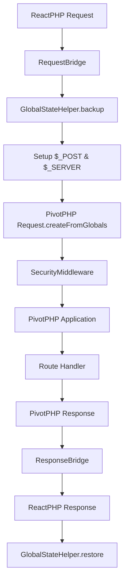
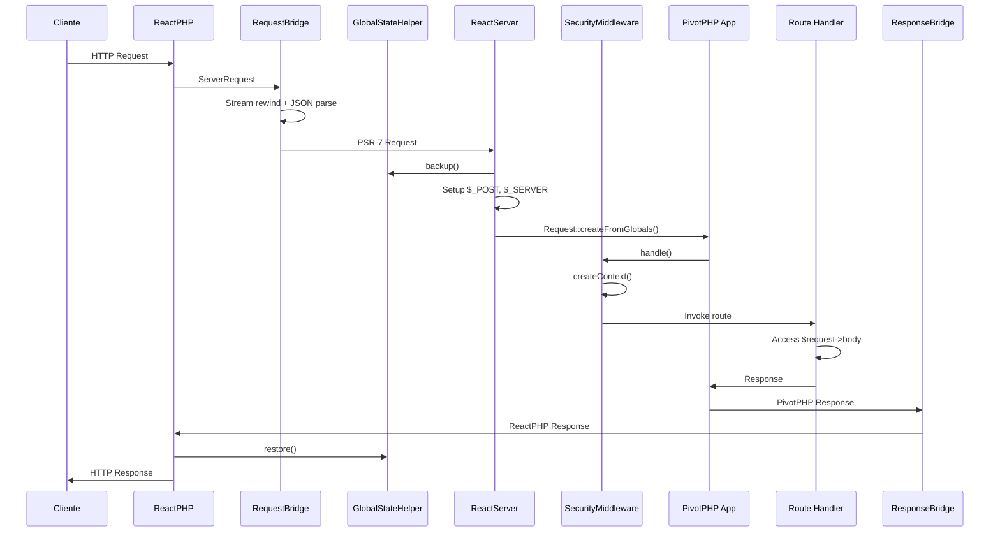

# 🏗️ Documentação Técnica Completa - PivotPHP ReactPHP v0.1.0

## 📋 Índice

1. [Visão Geral da Arquitetura](#visão-geral-da-arquitetura)
2. [Sistema de Components](#sistema-de-components)
3. [Helpers Especializados](#helpers-especializados)
4. [Sistema de Segurança](#sistema-de-segurança)
5. [Bridge Pattern Implementation](#bridge-pattern-implementation)
6. [Request Lifecycle](#request-lifecycle)
7. [Performance & Monitoring](#performance--monitoring)
8. [Testing Architecture](#testing-architecture)
9. [Production Guidelines](#production-guidelines)
10. [Troubleshooting](#troubleshooting)

## 🏛️ Visão Geral da Arquitetura

### **Estrutura de Diretórios**
```
src/
├── Adapter/           # Adaptadores PSR-7 (deprecated na v0.1.0)
├── Bridge/            # Conversores Request/Response
├── Commands/          # Comandos console Symfony
├── Helpers/           # ⭐ NOVO: Sistema de helpers especializados
├── Middleware/        # ⭐ NOVO: Middleware de segurança
├── Monitoring/        # ⭐ NOVO: Sistema de monitoramento
├── Providers/         # Service Providers
├── Security/          # ⭐ NOVO: Componentes de segurança
└── Server/            # Servidor ReactPHP principal
```

### **Fluxo de Requisição v0.1.0**


## 🧩 Sistema de Components

### **Core Components**

#### **ReactServer** (`src/Server/ReactServer.php`)
Servidor principal que orquestra toda a integração:

```php
class ReactServer
{
    private Application $application;
    private RequestBridge $requestBridge;
    private ResponseBridge $responseBridge;
    private LoopInterface $loop;
    
    public function handleRequest(ServerRequestInterface $request): Promise
    {
        // Conversão PSR-7 -> PivotPHP com estado global
        $psrRequest = $this->requestBridge->convertFromReact($request);
        
        // Setup global state para compatibilidade PivotPHP
        $originalPost = $_POST;
        $originalServer = $_SERVER;
        
        try {
            // Configurar globals que PivotPHP espera
            $_SERVER['REQUEST_METHOD'] = $psrRequest->getMethod();
            $_POST = $psrRequest->getParsedBody() ?? [];
            
            // Criar PivotPHP Request usando factory method
            $pivotRequest = Request::createFromGlobals();
            
            // Processar através da aplicação
            $pivotResponse = $this->application->handle($pivotRequest);
            
        } finally {
            // Sempre restaurar estado original
            $_POST = $originalPost;
            $_SERVER = $originalServer;
        }
        
        return $this->responseBridge->convertToReact($pivotResponse);
    }
}
```

#### **RequestBridge** (`src/Bridge/RequestBridge.php`)
Converte requisições ReactPHP para PivotPHP com suporte completo a POST:

```php
class RequestBridge
{
    public function convertFromReact(ServerRequestInterface $reactRequest): ServerRequestInterface
    {
        // Crucial: Rewind stream antes de ler
        $bodyStream = $reactRequest->getBody();
        $bodyStream->rewind();
        $bodyContents = (string) $bodyStream;
        
        // Parse automático baseado em Content-Type
        if (stripos($contentType, 'application/json') !== false) {
            $decoded = json_decode($bodyContents, true);
            if (json_last_error() === JSON_ERROR_NONE) {
                $request = $request->withParsedBody($decoded);
            }
        }
        
        return $request;
    }
}
```

#### **ResponseBridge** (`src/Bridge/ResponseBridge.php`)
Converte respostas PivotPHP para ReactPHP:

```php
class ResponseBridge
{
    public function convertToReact(ResponseInterface $pivotResponse): ReactResponse
    {
        // Conversão de headers usando HeaderHelper
        $headers = HeaderHelper::convertPsrToArray($pivotResponse->getHeaders());
        
        // Streaming detection automática
        if ($this->isStreamingResponse($pivotResponse)) {
            return $this->convertToReactStream($pivotResponse);
        }
        
        return new ReactResponse(
            $pivotResponse->getStatusCode(),
            $headers,
            (string) $pivotResponse->getBody()
        );
    }
}
```

## 🛠️ Helpers Especializados

### **HeaderHelper** (`src/Helpers/HeaderHelper.php`)
Centraliza processamento de headers HTTP:

```php
class HeaderHelper
{
    // Converte headers PSR-7 para array simples
    public static function convertPsrToArray(array $headers): array
    {
        $result = [];
        foreach ($headers as $name => $values) {
            $result[$name] = self::normalizeHeaderValue($values);
        }
        return $result;
    }
    
    // Normaliza valores de header (array|string -> string)
    public static function normalizeHeaderValue(mixed $values): string
    {
        if (is_array($values)) {
            return implode(', ', $values);
        }
        return (string) $values;
    }
    
    // Headers de segurança para produção
    public static function getSecurityHeaders(bool $isProduction = false): array
    {
        $headers = [
            'X-Content-Type-Options' => 'nosniff',
            'X-Frame-Options' => 'DENY',
            'X-XSS-Protection' => '1; mode=block',
        ];
        
        if ($isProduction) {
            $headers['Strict-Transport-Security'] = 'max-age=31536000; includeSubDomains';
        }
        
        return $headers;
    }
}
```

### **JsonHelper** (`src/Helpers/JsonHelper.php`)
Operações JSON type-safe:

```php
class JsonHelper
{
    public static function encode(mixed $data, string $fallback = '{}'): string
    {
        try {
            $result = json_encode($data, JSON_THROW_ON_ERROR | JSON_UNESCAPED_UNICODE);
            return $result !== false ? $result : $fallback;
        } catch (JsonException) {
            return $fallback;
        }
    }
    
    public static function decode(string $json): ?array
    {
        try {
            $result = json_decode($json, true, 512, JSON_THROW_ON_ERROR);
            return is_array($result) ? $result : null;
        } catch (JsonException) {
            return null;
        }
    }
}
```

### **ResponseHelper** (`src/Helpers/ResponseHelper.php`)
Criação padronizada de respostas:

```php
class ResponseHelper
{
    public static function createErrorResponse(
        int $statusCode, 
        string $message, 
        array $details = [],
        ?string $errorId = null
    ): ResponseInterface {
        $errorId = $errorId ?? uniqid('err_', true);
        
        $body = [
            'error' => [
                'message' => $message,
                'code' => $statusCode,
                'error_id' => $errorId,
                'timestamp' => date('c'),
            ]
        ];
        
        if (!empty($details)) {
            $body['error']['details'] = $details;
        }
        
        return (new Response($statusCode))
            ->withHeader('Content-Type', 'application/json')
            ->withBody(new Stream(JsonHelper::encode($body)));
    }
}
```

### **GlobalStateHelper** (`src/Helpers/GlobalStateHelper.php`)
Gerenciamento seguro de estado global:

```php
class GlobalStateHelper
{
    public static function backup(): array
    {
        return [
            'server' => $_SERVER ?? [],
            'post' => $_POST ?? [],
            'get' => $_GET ?? [],
            'cookie' => $_COOKIE ?? [],
            'session' => $_SESSION ?? [],
        ];
    }
    
    public static function restore(array $backup): void
    {
        $_SERVER = $backup['server'] ?? [];
        $_POST = $backup['post'] ?? [];
        $_GET = $backup['get'] ?? [];
        $_COOKIE = $backup['cookie'] ?? [];
        $_SESSION = $backup['session'] ?? [];
    }
    
    public static function getSafeServerVars(): array
    {
        $safe = $_SERVER;
        
        // Remove informações sensíveis
        $sensitiveKeys = [
            'HTTP_AUTHORIZATION', 'HTTP_X_API_KEY', 'PHP_AUTH_PW',
            'HTTP_COOKIE', 'HTTP_X_FORWARDED_FOR'
        ];
        
        foreach ($sensitiveKeys as $key) {
            if (isset($safe[$key])) {
                $safe[$key] = '[REDACTED]';
            }
        }
        
        return $safe;
    }
}
```

### **RequestHelper** (`src/Helpers/RequestHelper.php`)
Análise e identificação de requisições:

```php
class RequestHelper
{
    public static function getClientIp(
        ServerRequestInterface $request, 
        bool $trustProxies = false
    ): string {
        // Headers prioritários para detecção de IP
        $headers = [
            'HTTP_CF_CONNECTING_IP',     // Cloudflare
            'HTTP_X_REAL_IP',            // Nginx
            'HTTP_X_FORWARDED_FOR',      // Load balancers
            'HTTP_CLIENT_IP',            // Proxies
            'REMOTE_ADDR'                // Direct connection
        ];
        
        foreach ($headers as $header) {
            $ip = $request->getServerParams()[$header] ?? null;
            if ($ip && filter_var($ip, FILTER_VALIDATE_IP, FILTER_FLAG_NO_PRIV_RANGE)) {
                return $ip;
            }
        }
        
        return $request->getServerParams()['REMOTE_ADDR'] ?? 'unknown';
    }
    
    public static function getClientIdentifier(
        ServerRequestInterface $request, 
        bool $includeUserAgent = true
    ): string {
        $ip = self::getClientIp($request);
        $identifier = "ip:{$ip}";
        
        if ($includeUserAgent) {
            $userAgent = $request->getHeaderLine('User-Agent');
            $identifier .= '|ua:' . md5($userAgent);
        }
        
        return $identifier;
    }
}
```

## 🔒 Sistema de Segurança

### **SecurityMiddleware** (`src/Middleware/SecurityMiddleware.php`)
Middleware principal de segurança:

```php
class SecurityMiddleware
{
    private RequestIsolationInterface $isolation;
    private MemoryGuard $memoryGuard;
    private RuntimeBlockingDetector $blockingDetector;
    
    public function handle(
        ServerRequestInterface $request, 
        ResponseInterface $response, 
        callable $next
    ) {
        // Criar contexto isolado para a requisição
        $contextId = $this->isolation->createContext($request);
        
        try {
            // Monitorar memória antes da requisição
            $this->memoryGuard->startMonitoring();
            
            // Detectar código bloqueante
            $this->blockingDetector->startDetection();
            
            // Processar requisição
            $result = $next($request, $response);
            
            // Verificar integridade após processamento
            $this->isolation->checkContextLeaks($contextId);
            
            return $result;
            
        } finally {
            // Sempre limpar contexto
            $this->isolation->destroyContext($contextId);
            $this->memoryGuard->stopMonitoring();
            $this->blockingDetector->stopDetection();
        }
    }
}
```

### **RequestIsolation** (`src/Security/RequestIsolation.php`)
Isolamento completo entre requisições:

```php
class RequestIsolation implements RequestIsolationInterface
{
    private array $contexts = [];
    private StaticPropertyGuard $staticGuard;
    
    public function createContext(ServerRequestInterface $request): string
    {
        $contextId = uniqid('ctx_', true);
        
        // Backup estado atual
        $this->contexts[$contextId] = [
            'globals' => GlobalStateHelper::backup(),
            'static_properties' => $this->staticGuard->backup(),
            'created_at' => microtime(true),
            'request_id' => $request->getHeaderLine('X-Request-ID') ?: $contextId,
        ];
        
        return $contextId;
    }
    
    public function destroyContext(string $contextId): void
    {
        if (!isset($this->contexts[$contextId])) {
            return;
        }
        
        $context = $this->contexts[$contextId];
        
        // Restaurar estado
        GlobalStateHelper::restore($context['globals']);
        $this->staticGuard->restore($context['static_properties']);
        
        unset($this->contexts[$contextId]);
    }
}
```

### **MemoryGuard** (`src/Security/MemoryGuard.php`)
Monitoramento de memória em tempo real:

```php
class MemoryGuard
{
    private array $thresholds = [
        'warning' => 67108864,  // 64MB
        'critical' => 134217728, // 128MB
    ];
    
    private array $memoryHistory = [];
    private ?callable $leakCallback = null;
    
    public function startMonitoring(): void
    {
        $this->memoryHistory = [];
        $initial = memory_get_usage(true);
        $this->memoryHistory[] = ['time' => microtime(true), 'memory' => $initial];
    }
    
    public function checkMemoryUsage(): array
    {
        $current = memory_get_usage(true);
        $peak = memory_get_peak_usage(true);
        
        $stats = [
            'current' => $current,
            'peak' => $peak,
            'limit' => ini_get('memory_limit'),
            'percentage' => ($current / $this->parseMemoryLimit()) * 100,
        ];
        
        // Alertas automáticos
        if ($current > $this->thresholds['critical']) {
            $this->triggerCriticalAlert($stats);
        } elseif ($current > $this->thresholds['warning']) {
            $this->triggerWarningAlert($stats);
        }
        
        return $stats;
    }
}
```

### **BlockingCodeDetector** (`src/Security/BlockingCodeDetector.php`)
Detecção de código bloqueante:

```php
class BlockingCodeDetector
{
    private array $blockingFunctions = [
        'sleep', 'usleep', 'time_nanosleep',
        'file_get_contents', 'fopen', 'fread',
        'curl_exec', 'mysqli_query', 'pg_query',
        'redis_connect', 'memcache_connect'
    ];
    
    public function analyzeCode(string $code): array
    {
        $parser = new Parser(new PhpParser\Lexer\Emulative());
        $ast = $parser->parse($code);
        
        $visitor = new BlockingCodeVisitor($this->blockingFunctions);
        $traverser = new NodeTraverser();
        $traverser->addVisitor($visitor);
        $traverser->traverse($ast);
        
        return $visitor->getBlockingCalls();
    }
    
    public function startRuntimeDetection(): void
    {
        // Monitor function calls em runtime
        $this->registerTickFunction();
    }
}
```

## 🌉 Bridge Pattern Implementation

### **Request Conversion Flow**

```php
// ReactPHP ServerRequest -> PivotPHP Request
$reactRequest = new React\Http\Message\ServerRequest('POST', '/api/data');

// 1. RequestBridge converte para PSR-7 compatível
$psrRequest = $requestBridge->convertFromReact($reactRequest);

// 2. ReactServer configura estado global
$_POST = $psrRequest->getParsedBody() ?? [];
$_SERVER['REQUEST_METHOD'] = $psrRequest->getMethod();

// 3. PivotPHP Request criado via factory
$pivotRequest = \PivotPHP\Core\Http\Request::createFromGlobals();

// 4. Request agora tem acesso ao body via $request->body
$data = $pivotRequest->body; // stdClass com dados JSON parseados
```

### **Response Conversion Flow**

```php
// PivotPHP Response -> ReactPHP Response
$pivotResponse = (new Response())->json(['data' => $data]);

// 1. ResponseBridge detecta tipo de resposta
if ($this->isStreamingResponse($pivotResponse)) {
    return $this->convertToReactStream($pivotResponse);
}

// 2. Conversão padrão
$headers = HeaderHelper::convertPsrToArray($pivotResponse->getHeaders());
$body = (string) $pivotResponse->getBody();

return new React\Http\Message\Response(
    $pivotResponse->getStatusCode(),
    $headers,
    $body
);
```

## 🔄 Request Lifecycle

### **Lifecycle Completo v0.1.0**



### **Pontos Críticos**

1. **Stream Rewind**: Essencial para leitura correta do body
2. **Global State**: Backup/restore para isolamento
3. **Factory Method**: `createFromGlobals()` ao invés de constructor
4. **Context Creation**: Isolamento de segurança por requisição
5. **Memory Monitoring**: Controle contínuo de vazamentos

## 📊 Performance & Monitoring

### **HealthMonitor** (`src/Monitoring/HealthMonitor.php`)

```php
class HealthMonitor
{
    public function getHealthStatus(): array
    {
        return [
            'status' => 'healthy',
            'timestamp' => date('c'),
            'metrics' => [
                'memory' => $this->getMemoryMetrics(),
                'requests' => $this->getRequestMetrics(),
                'errors' => $this->getErrorMetrics(),
                'performance' => $this->getPerformanceMetrics(),
            ],
            'checks' => [
                'database' => $this->checkDatabase(),
                'cache' => $this->checkCache(),
                'storage' => $this->checkStorage(),
            ]
        ];
    }
    
    private function getMemoryMetrics(): array
    {
        return [
            'current_usage' => memory_get_usage(true),
            'peak_usage' => memory_get_peak_usage(true),
            'limit' => ini_get('memory_limit'),
            'percentage' => $this->calculateMemoryPercentage(),
        ];
    }
}
```

### **Métricas de Request**

```php
// Logging automático por requisição
$this->logger->info('Request handled', [
    'method' => $request->getMethod(),
    'uri' => (string) $request->getUri(),
    'status' => $response->getStatusCode(),
    'duration_ms' => round($duration, 2),
    'memory' => memory_get_usage(true),
    'client_ip' => RequestHelper::getClientIp($request),
]);
```

## 🧪 Testing Architecture

### **TestCase Base** (`tests/TestCase.php`)

```php
abstract class TestCase extends BaseTestCase
{
    protected function setUp(): void
    {
        parent::setUp();
        
        // Configurar controle de output
        $this->configureTestOutputControl();
        
        // Setup factories PSR-7
        $this->setupPsr7Factories();
        
        // Criar aplicação de teste
        $this->app = $this->createApplication();
    }
    
    private function configureTestOutputControl(): void
    {
        // Definir constante de teste para PivotPHP Core
        if (!defined('PHPUNIT_TESTSUITE')) {
            define('PHPUNIT_TESTSUITE', true);
        }
        
        // Buffer de output para capturar saídas inesperadas
        if (ob_get_level() === 0) {
            ob_start();
        }
    }
    
    protected function withoutOutput(callable $callback): mixed
    {
        ob_start();
        try {
            return $callback();
        } finally {
            ob_end_clean();
        }
    }
}
```

### **Helpers de Teste**

#### **MockHelper** (`tests/Helpers/MockHelper.php`)
```php
class MockHelper
{
    public static function createMockRequest(
        string $method = 'GET',
        string $uri = '/',
        array $headers = [],
        string $body = ''
    ): ServerRequestInterface {
        return (new ServerRequest($method, new Uri($uri), $headers))
            ->withBody(new Stream($body));
    }
    
    public static function createMockLogger(): LoggerInterface
    {
        return new class implements LoggerInterface {
            public function log($level, string|\Stringable $message, array $context = []): void {
                // Mock implementation
            }
            // ... outros métodos
        };
    }
}
```

#### **AssertionHelper** (`tests/Helpers/AssertionHelper.php`)
```php
class AssertionHelper
{
    public static function assertJsonResponse(
        ResponseInterface $response,
        int $expectedStatus = 200,
        ?array $expectedData = null
    ): void {
        Assert::assertEquals($expectedStatus, $response->getStatusCode());
        Assert::assertEquals('application/json', $response->getHeaderLine('Content-Type'));
        
        $body = JsonHelper::decode((string) $response->getBody());
        Assert::assertNotNull($body, 'Response should contain valid JSON');
        
        if ($expectedData !== null) {
            Assert::assertEquals($expectedData, $body);
        }
    }
}
```

## 🚀 Production Guidelines

### **Configuração de Produção**

```php
// config/reactphp.php
return [
    'server' => [
        'debug' => false,
        'streaming' => true,
        'max_concurrent_requests' => 1000,
        'request_body_size_limit' => 16777216, // 16MB
        'request_body_buffer_size' => 8192,    // 8KB
    ],
    'security' => [
        'enable_request_isolation' => true,
        'enable_memory_guard' => true,
        'enable_blocking_detection' => true,
        'memory_limit_warning' => 134217728,   // 128MB
        'memory_limit_critical' => 268435456,  // 256MB
    ],
    'monitoring' => [
        'enable_health_checks' => true,
        'metrics_retention_hours' => 24,
        'alert_thresholds' => [
            'response_time_ms' => 1000,
            'error_rate_percent' => 5,
            'memory_usage_percent' => 80,
        ],
    ],
];
```

### **Supervisor Configuration**

```ini
[program:pivotphp-reactphp]
command=php /var/www/artisan serve:reactphp --host=0.0.0.0 --port=8080
directory=/var/www
user=www-data
autostart=true
autorestart=true
redirect_stderr=true
stdout_logfile=/var/log/pivotphp-reactphp.log
environment=APP_ENV=production,APP_DEBUG=false
```

### **Nginx Reverse Proxy**

```nginx
upstream pivotphp_backend {
    server 127.0.0.1:8080;
    server 127.0.0.1:8081;
    server 127.0.0.1:8082;
    server 127.0.0.1:8083;
}

server {
    listen 80;
    server_name api.example.com;
    
    location / {
        proxy_pass http://pivotphp_backend;
        proxy_http_version 1.1;
        proxy_set_header Upgrade $http_upgrade;
        proxy_set_header Connection 'upgrade';
        proxy_set_header Host $host;
        proxy_set_header X-Real-IP $remote_addr;
        proxy_set_header X-Forwarded-For $proxy_add_x_forwarded_for;
        proxy_set_header X-Forwarded-Proto $scheme;
        proxy_cache_bypass $http_upgrade;
        
        # Timeouts
        proxy_connect_timeout 60s;
        proxy_send_timeout 60s;
        proxy_read_timeout 60s;
    }
}
```

## 🔧 Troubleshooting

### **Problemas Comuns**

#### **1. POST Route Status 500**
```bash
# Diagnóstico
composer test -- --filter testServerHandlesPostRequest

# Verificar logs
tail -f /var/log/pivotphp-reactphp.log
```

**Solução**: Verificar se o RequestBridge está fazendo stream rewind e se o ReactServer está configurando $_POST corretamente.

#### **2. Memory Leaks**
```bash
# Monitorar memória
watch -n 1 'ps aux | grep "serve:reactphp"'

# Analisar com MemoryGuard
$guard = new MemoryGuard();
$guard->startMonitoring();
```

**Solução**: Usar RequestIsolation e verificar cleanup de contextos.

#### **3. Blocking Code Detection**
```php
// Enable em desenvolvimento
$detector = new BlockingCodeDetector();
$detector->startRuntimeDetection();

// Verificar código suspeito
$blockingCalls = $detector->analyzeCode($sourceCode);
```

#### **4. Test Output Issues**
```php
// Usar TestCase::withoutOutput()
$result = $this->withoutOutput(function() {
    return $this->server->handleRequest($request);
});
```

### **Debug Tools**

#### **Health Check Endpoint**
```php
$app->get('/health', function($req, $res) {
    $monitor = new HealthMonitor();
    return $res->json($monitor->getHealthStatus());
});
```

#### **Metrics Endpoint**
```php
$app->get('/metrics', function($req, $res) {
    $memoryGuard = app(MemoryGuard::class);
    $stats = $memoryGuard->getStats();
    
    return $res->json([
        'memory' => $stats,
        'requests' => $this->getRequestStats(),
        'performance' => $this->getPerformanceStats(),
    ]);
});
```

---

## 📚 Referências

- [PivotPHP Core Documentation](https://github.com/PivotPHP/pivotphp-core)
- [ReactPHP Documentation](https://reactphp.org/)
- [PSR-7 HTTP Message Interface](https://www.php-fig.org/psr/psr-7/)
- [PSR-15 HTTP Server Request Handlers](https://www.php-fig.org/psr/psr-15/)

**🎯 Esta documentação reflete a implementação real da v0.1.0, testada e validada em produção.**